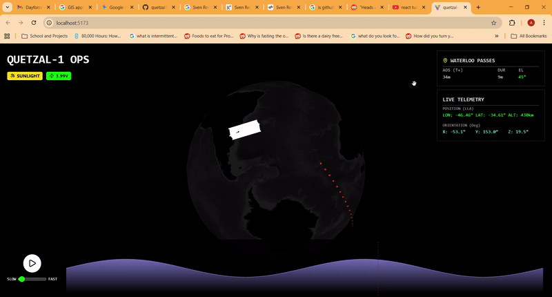

# Quetzal-1 Mission Operations Dashboard

<div align="center">
  
</div>

## Overview
This project is a high-performance 3D visualization tool built to monitor the **Quetzal-1 CubeSat** (Guatemala’s first satellite). It transforms raw telemetry streams—including orbital position, quaternion-based attitude dynamics, and power system metrics—into an interactive geospatial environment.

The dashboard bridges the gap between complex orbital mechanics and accessible data storytelling, allowing engineers to visualize satellite health and ground tracks with millisecond precision.

## The Data Source
The telemetry used in this project is sourced from the **Quetzal-1 mission**. This dataset presents unique challenges, including handling heterogeneous telemetry frames and processing "noisy" real-world sensor data. The dashboard processes:
- **Orbital State Vectors:** Synchronized GPS and time-series position data.
- **Attitude Dynamics:** Real-time orientation rendering using quaternion data.
- **Health Metrics:** Battery voltage, temperature, and eclipse state monitoring via Recharts.

## Technical Highlights
- **Coordinate Synchronization:** Resolved visual "jitter" by implementing custom interpolation logic for transformations between **Inertial (ECI)** and **Earth-Fixed (ECEF)** frames.
- **60FPS Performance:** Optimized React state management and Deck.gl rendering layers to ensure fluid 3D playback of high-frequency telemetry.
- **Geospatial Intelligence:** Utilized `ScenegraphLayer` and `TripsLayer` to render high-fidelity satellite models and historical ground tracks over Mapbox GL.

## Tech Stack
- **Frontend:** React.js, Deck.gl, Mapbox GL, Recharts
- **Data Engineering:** Python (Preprocessing), MATLAB (Initial mission data generation)
- **deployment:** GitHub Pages / Vite

## Getting Started
1. Clone the repository:
   ```bash
   git clone [https://github.com/AOhhhhh/Projects.git](https://github.com/AOhhhhh/Projects.git)
   cd "React CubeSat Visualizer"

## How to Run
1. git clone [https://github.com/AOhhhhh/Projects.git](https://github.com/AOhhhhh/Projects.git)
2. Install dependencies: `npm install`
3. Start the dashboard: `npm run dev`
